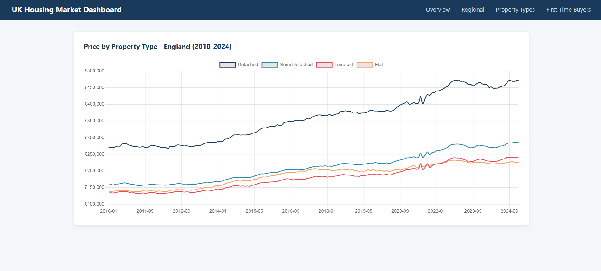
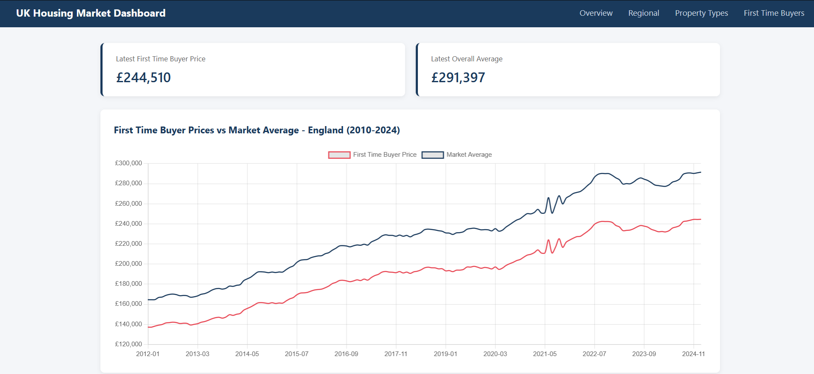

# UK Housing Market Dashboard

A Django web application that analyses UK housing market trends using official government data from the UK House Price Index.

Built as a demonstration of end-to-end data engineering - ingesting raw CSV data into a SQLite database and surfacing analysis through a web application with interactive charts.

## What it does

- Loads 73,000+ rows of UK House Price Index data into a SQLite database
- Queries the database using raw SQL to power four analytical views
- Displays results through an interactive web dashboard built with Django and Chart.js

## Screenshots





## Pages

| Page | What it shows |
|---|---|
| Overview | England average house price trend 2010–2024 with 12-month change KPI |
| Regional | Top 20 regions by average price at latest available date |
| Property Types | Price trends by property type - detached, semi-detached, terraced, flat |
| First Time Buyers | First time buyer prices vs market average - affordability gap over time |

## Tech Stack

- **Python** - data ingestion and processing
- **Pandas** - CSV parsing, data cleaning, dataframe manipulation
- **SQLAlchemy** - database connection and query execution
- **SQLite** - lightweight relational database storing the housing data
- **Django** - web framework handling routing, views and templating
- **Chart.js** - interactive chart rendering in the browser

## Data Source

UK House Price Index - official government data published by HM Land Registry.
Covers all local authority areas across England, Wales, Scotland and Northern Ireland from 1969 to 2024.
Filtered to 2010 onwards for relevance.

## How to run

1. Clone the repo
2. Install dependencies
```
pip install django pandas sqlalchemy openpyxl
```
3. Load the data into the database
```
python load_data.py
```
4. Run the development server
```
cd housing_dashboard
python manage.py runserver
```
5. Open browser at `http://127.0.0.1:8000`

## Why housing data

L&Q is one of the UK's largest housing associations operating primarily in London and the South East. This dataset is directly relevant to understanding the affordability challenges L&Q exists to address - particularly the first time buyer affordability gap visible on the FTB page, where the market average has pulled significantly ahead of first time buyer prices since 2021.
```
